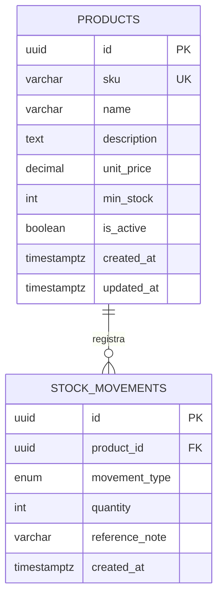
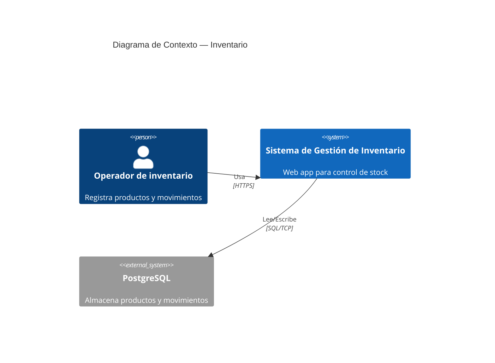
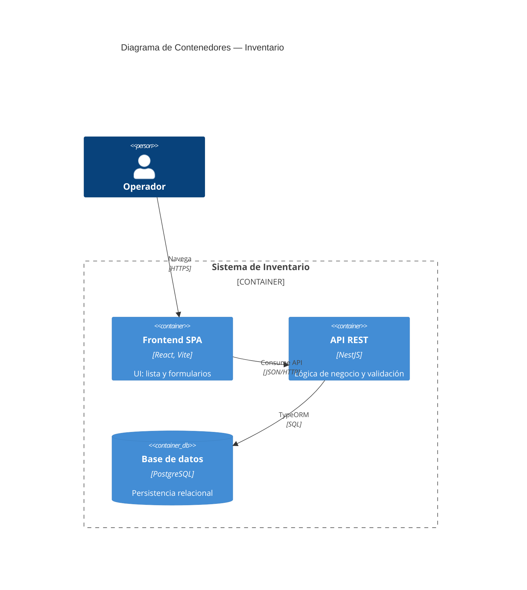

# PRD — Sistema de Gestión de Inventario

| Campo | Valor |
| --- | --- |
| **Proyecto** | proyecto-inventario |
| **Versión** | 1.0.0 |
| **Estado** | Borrador inicial |
| **Stack** | NestJS, React, TypeORM, PostgreSQL |

---

## 1. Objetivo

Construir un sistema web de gestión de inventario que permita a un operador de almacén **registrar productos**, **documentar entradas y salidas de stock**, **consultar el stock disponible en tiempo real** y **recibir alertas cuando el inventario esté por debajo del umbral mínimo**, reduciendo errores manuales y pérdidas por desabastecimiento.

El producto debe servir como proyecto formativo del curso *AI for Devs*, demostrando buenas prácticas de arquitectura (Clean Architecture en backend), validación de datos, transacciones atómicas en operaciones de inventario y una interfaz React consumiendo API REST.

---

## 2. Alcance

### 2.1 Dentro del alcance (MVP)

| Área | Funcionalidad |
| --- | --- |
| **Productos** | CRUD completo: crear, listar, obtener por id, actualizar y eliminar (soft delete o baja lógica recomendada). |
| **Movimientos** | Registro de movimientos de tipo `ENTRY` (entrada) y `EXIT` (salida) asociados a un producto. |
| **Stock** | Cálculo del stock actual por producto a partir del historial de movimientos (fuente de verdad). |
| **Alertas** | Listado de productos cuyo stock actual es menor o igual al stock mínimo configurado. |
| **Frontend** | Vista de lista de productos con indicador de stock/alerta y formulario de alta/edición. |
| **API** | REST JSON, documentación OpenAPI/Swagger (recomendado). |
| **Persistencia** | PostgreSQL con migraciones TypeORM. |

### 2.2 Fuera del alcance (MVP)

- Autenticación y autorización (roles, JWT).
- Multi-almacén / multi-sucursal.
- Integración con ERP, facturación o códigos de barras.
- Reportes avanzados, exportación PDF/Excel.
- Notificaciones push o por correo.
- App móvil nativa.

---

## 3. Usuarios y necesidades

| Persona | Necesidad principal |
| --- | --- |
| **Operador de inventario** | Registrar productos y movimientos de forma rápida y sin inconsistencias. |
| **Supervisor de almacén** | Ver stock actual y productos en riesgo de quiebre. |
| **Desarrollador del curso** | Código mantenible, convenciones claras y documentación para implementar por iteraciones. |

---

## 4. Restricciones técnicas

| Restricción | Detalle |
| --- | --- |
| **Backend** | NestJS 11+, TypeScript, módulos por dominio (`products`, `stock-movements`, `alerts`). |
| **ORM** | TypeORM con entidades, repositorios y `DataSource.transaction` en toda operación que modifique stock. |
| **Base de datos** | PostgreSQL 15+; variables de entorno vía `.env` (no commitear secretos). |
| **Validación** | DTOs con `class-validator` y `class-transformer` en POST/PATCH. |
| **Errores** | Excepciones NestJS: `BadRequestException`, `NotFoundException`, `ConflictException`. |
| **Frontend** | React 19+ con Vite; componentes en PascalCase; consumo HTTP con Axios. |
| **Naming backend** | Clases en CamelCase; archivos en kebab-case (`products.controller.ts`). |
| **Naming frontend** | Componentes y páginas en PascalCase (`ProductList.tsx`). |
| **Concurrencia** | Operaciones de inventario siempre dentro de transacción para evitar condiciones de carrera. |
| **CORS** | Habilitado en desarrollo para origen del frontend (puerto Vite por defecto). |

---

## 5. Modelo de datos (texto relacional)

### 5.1 Entidades

**`products`**

| Columna | Tipo | Restricciones |
| --- | --- | --- |
| `id` | UUID | PK, default `gen_random_uuid()` |
| `sku` | VARCHAR(50) | UNIQUE, NOT NULL |
| `name` | VARCHAR(200) | NOT NULL |
| `description` | TEXT | NULL |
| `unit_price` | DECIMAL(12,2) | NOT NULL, >= 0 |
| `min_stock` | INTEGER | NOT NULL, >= 0, default 0 |
| `is_active` | BOOLEAN | NOT NULL, default true |
| `created_at` | TIMESTAMPTZ | NOT NULL, default now() |
| `updated_at` | TIMESTAMPTZ | NOT NULL, default now() |

**`stock_movements`**

| Columna | Tipo | Restricciones |
| --- | --- | --- |
| `id` | UUID | PK |
| `product_id` | UUID | FK → `products.id`, ON DELETE RESTRICT |
| `movement_type` | ENUM('ENTRY','EXIT') | NOT NULL |
| `quantity` | INTEGER | NOT NULL, > 0 |
| `reference_note` | VARCHAR(500) | NULL |
| `created_at` | TIMESTAMPTZ | NOT NULL, default now() |

### 5.2 Reglas de negocio del modelo

1. El **stock actual** de un producto se calcula como:  
   `SUM(quantity WHERE movement_type = 'ENTRY') - SUM(quantity WHERE movement_type = 'EXIT')`.
2. No se permite registrar una salida (`EXIT`) si el stock resultante sería negativo.
3. Un producto con `is_active = false` no acepta nuevos movimientos (recomendado).
4. El `sku` es inmutable tras la creación o se valida unicidad en actualización.

### 5.3 Diagrama ER (Mermaid)



---

## 6. Arquitectura C4 (nivel básico)

### 6.1 Contexto (C4 — Nivel 1)



### 6.2 Contenedores (C4 — Nivel 2)



### 6.3 Componentes backend (referencia)

```
backend/src/
├── products/           # CRUD, consulta de stock por producto
├── stock-movements/    # Registro ENTRY/EXIT con transacción
├── alerts/             # Productos bajo min_stock
├── common/             # Filtros, pipes, interceptors
└── database/           # Config TypeORM, migraciones
```

---

## 7. Contratos API (resumen)

| Método | Ruta | Descripción |
| --- | --- | --- |
| `POST` | `/products` | Crear producto |
| `GET` | `/products` | Listar productos (paginación opcional) |
| `GET` | `/products/:id` | Detalle de producto |
| `PATCH` | `/products/:id` | Actualizar producto |
| `DELETE` | `/products/:id` | Baja lógica / eliminar |
| `POST` | `/stock-movements` | Registrar entrada o salida |
| `GET` | `/products/:id/stock` | Stock actual calculado |
| `GET` | `/alerts/low-stock` | Productos en alerta |

---

## 8. Criterios de aceptación del producto (MVP)

### 8.1 Productos (CRUD)

- [ ] **AC-PRD-01**: Se puede crear un producto con `sku`, `name`, `unitPrice` y `minStock`; respuesta `201` con el recurso creado.
- [ ] **AC-PRD-02**: `sku` duplicado devuelve `409 Conflict` con mensaje claro.
- [ ] **AC-PRD-03**: Listado devuelve todos los productos activos con metadatos de stock (calculado o enriquecido).
- [ ] **AC-PRD-04**: Actualización parcial valida tipos; campos inválidos devuelven `400`.
- [ ] **AC-PRD-05**: Eliminación o baja lógica impide nuevos movimientos sobre el producto.

### 8.2 Movimientos de stock

- [ ] **AC-PRD-06**: Entrada (`ENTRY`) incrementa el stock disponible tras la transacción.
- [ ] **AC-PRD-07**: Salida (`EXIT`) rechaza la operación con `400` si el stock quedaría negativo.
- [ ] **AC-PRD-08**: Cantidad `<= 0` o tipo inválido devuelve `400`.
- [ ] **AC-PRD-09**: Producto inexistente devuelve `404`.
- [ ] **AC-PRD-10**: Cada movimiento queda persistido con `productId`, `movementType`, `quantity` y timestamp.

### 8.3 Cálculo de stock

- [ ] **AC-PRD-11**: `GET /products/:id/stock` devuelve `{ productId, currentStock, minStock, isBelowMinimum }`.
- [ ] **AC-PRD-12**: El stock refleja la suma algebraica de todos los movimientos del producto.
- [ ] **AC-PRD-13**: Producto sin movimientos reporta `currentStock = 0`.

### 8.4 Alertas

- [ ] **AC-PRD-14**: `GET /alerts/low-stock` lista solo productos con `currentStock <= minStock` y `isActive = true`.
- [ ] **AC-PRD-15**: La respuesta incluye `sku`, `name`, `currentStock` y `minStock` para acción operativa.

### 8.5 Frontend

- [ ] **AC-PRD-16**: La lista muestra productos con columnas relevantes y badge/visual de alerta cuando aplica.
- [ ] **AC-PRD-17**: Errores de API se muestran al usuario (toast o alerta visible).
- [ ] **AC-PRD-18**: El formulario valida campos obligatorios antes de enviar y soporta crear y editar.
- [ ] **AC-PRD-19**: Tras guardar exitoso, el usuario vuelve a la lista o ve confirmación clara.

### 8.6 No funcionales

- [ ] **AC-PRD-20**: Operaciones de movimiento usan `DataSource.transaction`.
- [ ] **AC-PRD-21**: Variables sensibles solo en `.env`; `.env.example` documentado en README.
- [ ] **AC-PRD-22**: Backend y frontend arrancan en local con instrucciones del README.

---

## 9. Métricas de éxito

| Métrica | Objetivo MVP |
| --- | --- |
| Tiempo de respuesta API (p95) | < 300 ms en entorno local |
| Consistencia de stock | 0 inconsistencias en pruebas de concurrencia básica |
| Cobertura de historias | 6/6 historias implementadas y verificables manualmente |

---

## 10. Riesgos y mitigaciones

| Riesgo | Mitigación |
| --- | --- |
| Condiciones de carrera en salidas simultáneas | Transacciones + validación de stock dentro de la misma transacción |
| Stock calculado lento con muchos movimientos | Índice en `stock_movements(product_id)`; vista materializada en fase 2 |
| Desincronización frontend/backend | Tipos compartidos o contrato OpenAPI como referencia |

---

## 11. Roadmap sugerido

1. **Sprint 1**: Modelo de datos, módulo `products` (CRUD), migraciones.
2. **Sprint 2**: Módulo `stock-movements`, cálculo de stock, transacciones.
3. **Sprint 3**: Módulo `alerts`, frontend lista + formulario.
4. **Sprint 4**: Pruebas e2e, pulido UX, documentación de despliegue.

---

## 12. Referencias

- Convenciones del repositorio: `.cursorrules`
- Historias de usuario: `docs/user-stories.md`
- Tickets de implementación: `docs/tickets.md`
- Prompts del curso: `prompts.md`
